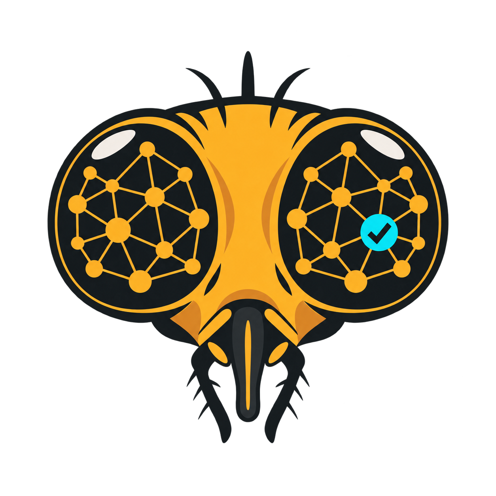

<p align="center">
  
</p>

<h1 align="center">BugBrain</h1>

<p align="center"><strong>Peer review, but the peer has 139,255 neurons.</strong></p>

<p align="center">
  <a href="https://github.com/Veridical-dev/bugbrain/actions/workflows/ci.yml"></a>
  <a href="LICENSE"></a>
  <a href="https://www.python.org/"></a>
  <a href="https://doi.org/10.5281/zenodo.21549559"></a>
</p>

BugBrain is an open experiment that routes—and now trains a high-level controller for—agentic code reviewers using the wiring diagram of a real adult fruit-fly brain. Code changes become signals, signals pass through a fixed FlyWire connectome, and the resulting state either assigns review work or chooses the next repository action for a Codex worker.

The connectome does **not** understand TypeScript. It is routing metadata, not evidence. The agents still have to inspect the repository and justify every finding from code.

## The delightfully awkward result

We ran two different experiments, and honesty requires keeping both:

| Question | Result |
|---|---|
| Does biological fly wiring beat carefully matched random reservoirs at routing code? | **No measurable advantage.** All paired bootstrap intervals crossed zero. |
| Can a fly-routed agent swarm find real bugs when every agent gets full repository access? | On one Formbricks PR, **BugBrain found 2 verified defect roots CodeRabbit missed; CodeRabbit found 1 BugBrain missed.** |
| Can a trained connectome controller beat ordinary agent execution? | **Not in the frozen POC.** Biological BugBrain tied direct Codex at 5/6 repairs, took 1.19× the input tokens and 2.39× the worker time, and did not beat its graph nulls offline. |

That is not proof that flies are better code reviewers. It is proof that weird experiments become useful when they have controls, receipts, and the courage to publish the embarrassing part.

Read the full [paper](PAPER.md), the compact [results](RESULTS.md), the [architecture](docs/ARCHITECTURE.md), and the new [training protocol](docs/TRAINING.md).

## What happens under the hood

```text
                                ┌─► focus bundles ─► independent Codex reviewers
repository observation ─► fly ─┤
                                └─► trained action policy ─► search / inspect / test /
                                                             reason / patch / verify / stop
```

In trained-controller mode, Codex supplies the language reasoning and concrete tool arguments while BugBrain chooses the high-level action. The worker still gets the full repository and normal shell/tool capacity. The connectome is a controller, not a substitute language model.

The routing experiment uses a 512-neuron, 6,421-edge core selected from the 139,255-neuron FlyWire FAFB v783 graph. The trained controller uses a 2,048-neuron, 75,803-edge core. Both experiments pair the biological graph with explicit nulls that preserve the relevant dimensions, weights, interfaces, data, and initialization while ablating biological structure.

## Quick start

Requirements: Python 3.11+, [uv](https://docs.astral.sh/uv/) or pip, Git, and enough curiosity to download about 179 MB of neuroscience data.

```bash
git clone https://github.com/Veridical-dev/bugbrain.git
cd bugbrain
uv sync
uv run bugbrain download
uv run bugbrain build
uv run bugbrain reservoir-poc \
  --corpus examples/corpus.json \
  --holdout tiny_retry_change \
  --out out/tiny-fly-brain.json
```

The bundled corpus is deliberately tiny: it verifies that the full pipeline works, not that the fly deserves tenure.

### Train the fly-constrained controller

Record real `codex exec --json` trajectories, attach verifier rewards, and train paired biological and null arms:

```bash
uv run bugbrain trace-import \
  --jsonl trace.jsonl --key task-001 --split train \
  --goal "Review the authentication change" --reward 1 \
  --out trajectories.json
uv run bugbrain policy-train \
  --trajectories trajectories.json --neurons 2048 --seeds 10 \
  --checkpoint-dir out/checkpoints --out out/policy-report.json
```

The policy backpropagates through fixed FlyWire edges and learns recurrent flow gains plus an action decoder. Every run includes a weight shuffle, a degree-preserving rewiring, and an observation-only control. See [Training BugBrain](docs/TRAINING.md) before interpreting any number; the bundled trajectories are a mechanics fixture, not a result.

The frozen real-repository corpus is also included. It contains 16 verified Codex
episodes (8 train, 2 validation, 6 test) and 153 observed actions. Across 30
paired training seeds, biological topology reached 49.7% held-out action
accuracy; degree-preserving rewiring reached 52.0%. In live repair, the
validation-selected biological checkpoint and direct Codex each passed 5/6
held-out verifiers, but on different tasks. See the [controller result](RESULTS.md#trained-controller-experiment)
and [machine-readable receipt](results/controller-benchmark.json).

Run a selected checkpoint in a disposable checkout with the same repository-capable worker:

```bash
uv run bugbrain policy-run \
  --checkpoint benchmarks/controller/checkpoints/biological-seed-2323.npz \
  --repo /path/to/disposable/checkout \
  --goal "Fix the failing regression" \
  --mode implement --max-steps 12 \
  --verifier-json /path/to/verifier.json \
  --out-dir out/live-run
```

### Run an agentic review

The standalone runner calls the Codex CLI directly—there is no proprietary review engine in the loop. Build a reservoir routing artifact whose holdout is the target PR, then point BugBrain at a clean checkout of its exact head:

```bash
uv run bugbrain standalone-review \
  --routing out/my-pr-routing.json \
  --arm biological \
  --out-dir out/my-pr-review \
  --repo /path/to/clean/checkout \
  --base <exact-base-sha> \
  --head <exact-head-sha> \
  --model <your-codex-model> \
  --reasoning-effort low \
  --use-user-config
```

Each reviewer may search every repository file, inspect the complete base-to-head diff, follow definitions and callers, and run read-only shell commands. The connectome-selected bundle is a focus assignment—not a context prison. The runner refuses a dirty checkout, a mismatched head, or a changed repository receipt.

See [Reproducing the experiments](docs/REPRODUCING.md) for the full protocol.

## Things BugBrain is not

- A production-ready GitHub bot
- A claim that neural anatomy magically understands source code
- A fine-tuned LLM or a biophysically faithful digital fly
- A benchmark proving superiority over CodeRabbit, Codex, or anyone else
- Affiliated with or endorsed by the FlyWire Consortium, the cited researchers, Formbricks, CodeRabbit, or ESA
- Medical advice for flies

## Why open-source a negative result?

Because “we tried something strange and measured it properly” is more interesting than another architecture diagram with no falsifiable claim. The controls are the product here. If someone finds a representation, task, or learning rule where the biological graph consistently beats its nulls, we want to know.

Good first contributions include preregistered Codex trajectory corpora, hidden repository verifiers, stronger graph nulls, alternative neuron selections, routing visualizations, and attempts to reproduce or falsify the current result. Please read [CONTRIBUTING.md](CONTRIBUTING.md).

## Data, attribution, and license

BugBrain code and original project assets are Apache-2.0 licensed. FlyWire-derived data is downloaded separately and remains under its source license. See [NOTICE](NOTICE) and [data/README.md](data/README.md) before redistributing derived data.

Built by [Veridical](https://veridical.dev/) with respect for fruit flies and mild concern for software engineering.
